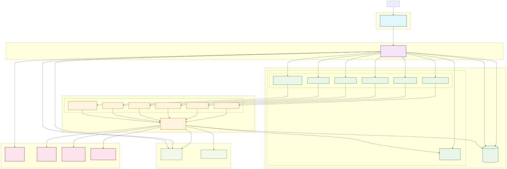

# Eclaire System Architecture

This document describes the overall system architecture of Eclaire, an AI assistant focused on privacy and self-hosting.

## Architecture Overview



<details>
<summary>📝 View Mermaid source code</summary>

```mermaid
graph TB
    %% Users
    User[👤 User]
    
    %% Frontend Layer
    subgraph "Frontend Layer"
        Frontend[🌐 Next.js Frontend<br/>Port 3000<br/>React, Tailwind, Radix UI]
    end
    
    %% Backend Layer  
    subgraph "Backend Layer"
        Backend[⚙️ Node.js Backend API<br/>Port 3001<br/>Hono, Zod, Better Auth]
    end
    
    %% Workers Layer
    subgraph "Workers Layer"
        Workers[🔄 Background Workers<br/>Node.js + BullMQ<br/>Job Processing]
        
        subgraph "Worker Jobs"
            BookmarkJob[📎 Bookmark Processor]
            ImageJob[🖼️ Image Processor]  
            DocJob[📄 Document Processor]
            NoteJob[📝 Note Processor]
            TaskJob[✅ Task Processor]
            TaskExecJob[🤖 Task Execution Processor]
        end
    end
    
    %% Data Layer
    subgraph "Data Layer"
        subgraph "Redis Cluster"
            Redis[📦 Redis<br/>Port 6379<br/>Caching & Queues]
            
            subgraph "BullMQ Queues"
                BookmarkQ["📎 bookmark-processing"]
                ImageQ["🖼️ image-processing"] 
                DocQ["📄 document-processing"]
                NoteQ["📝 note-processing"]
                TaskQ["✅ task-processing"]
                TaskExecQ["🤖 task-execution-processing"]
            end
        end
        
        Postgres[(🗄️ PostgreSQL<br/>Port 5432<br/>Primary Database<br/>Drizzle ORM)]
    end
    
    %% External Services
    subgraph "AI & External Services"
        LlamaCpp[🧠 llama-server<br/>Port 11435<br/>Local AI Models<br/>Gemma-3-4b-it]
        Docling[📑 Docling<br/>Port 5001<br/>Document Processing<br/>PDF, RTF, etc.]
        ExtAPIs[🌐 External APIs<br/>Twitter, GitHub, Reddit<br/>Rate Limited]
    end
    
    %% File System
    subgraph "Storage"
        DataVol[📁 ./data Volume<br/>Persistent Storage<br/>Config, Logs, Files]
        BrowserData[🌐 ./data/browser-data<br/>Playwright Cache]
    end
    
    %% User Interactions
    User --> Frontend
    
    %% Frontend to Backend
    Frontend -->|HTTP REST API<br/>WebSocket/SSE Streaming<br/>Authentication| Backend
    
    %% Backend to Data Layer
    Backend -->|SQL Queries<br/>Drizzle ORM| Postgres
    Backend -->|Job Enqueuing<br/>Caching| Redis
    Backend -->|Auth Sessions<br/>Better Auth| Postgres
    
    %% Workers Communication
    Backend -->|Enqueue Jobs| BookmarkQ
    Backend -->|Enqueue Jobs| ImageQ
    Backend -->|Enqueue Jobs| DocQ
    Backend -->|Enqueue Jobs| NoteQ
    Backend -->|Enqueue Jobs| TaskQ
    Backend -->|Enqueue Jobs| TaskExecQ
    
    %% Queue Processing
    BookmarkQ -->|Process| BookmarkJob
    ImageQ -->|Process| ImageJob
    DocQ -->|Process| DocJob
    NoteQ -->|Process| NoteJob
    TaskQ -->|Process| TaskJob
    TaskExecQ -->|Process| TaskExecJob
    
    %% Worker Jobs to Workers
    BookmarkJob --> Workers
    ImageJob --> Workers
    DocJob --> Workers
    NoteJob --> Workers
    TaskJob --> Workers
    TaskExecJob --> Workers
    
    %% Workers to External Services
    Workers -->|HTTP Requests<br/>Rate Limited| ExtAPIs
    Workers -->|AI Inference<br/>OpenAI Compatible| LlamaCpp
    Workers -->|Document Conversion<br/>HTTP API| Docling
    Workers -->|Database Updates<br/>Job Results| Postgres
    Workers -->|Progress Updates<br/>Job Status| Redis
    
    %% Storage Access
    Workers -->|File I/O<br/>Screenshots, PDFs| DataVol
    Workers -->|Browser Cache<br/>Playwright Data| BrowserData
    Backend -->|Config Files<br/>models.json| DataVol
    Backend -->|Logs, Uploads| DataVol
    
    %% Styling
    classDef frontend fill:#e1f5fe,stroke:#0277bd,stroke-width:2px
    classDef backend fill:#f3e5f5,stroke:#7b1fa2,stroke-width:2px
    classDef workers fill:#fff3e0,stroke:#f57c00,stroke-width:2px
    classDef data fill:#e8f5e8,stroke:#388e3c,stroke-width:2px
    classDef external fill:#fce4ec,stroke:#c2185b,stroke-width:2px
    classDef storage fill:#f1f8e9,stroke:#689f38,stroke-width:2px
    
    class Frontend frontend
    class Backend backend
    class Workers,BookmarkJob,ImageJob,DocJob,NoteJob,TaskJob,TaskExecJob workers
    class Redis,Postgres,BookmarkQ,ImageQ,DocQ,NoteQ,TaskQ,TaskExecQ data
    class LlamaCpp,Docling,ExtAPIs external
    class DataVol,BrowserData storage
```

> **Note**: To regenerate the SVG after modifying the diagram, run:
> ```bash
> mmdc -i docs/architecture.mmd -o docs/assets/architecture.svg
> ```

</details>

## Component Details

### Frontend Layer
- **Technology**: Next.js 15 with React 19
- **UI Framework**: Radix UI components with Tailwind CSS
- **Features**: 
  - Progressive Web App (PWA) support
  - Dark/light theme support
  - Real-time updates via WebSocket/SSE
  - Authentication with Better Auth
  - API documentation with Scalar

### Backend API Layer
- **Technology**: Node.js with Hono web framework
- **Key Features**:
  - RESTful API with OpenAPI specification
  - WebSocket and Server-Sent Events for real-time features
  - Authentication and session management
  - File upload and processing
  - Job scheduling and queue management
  - Rate limiting and security middleware

### Workers Layer
- **Technology**: Node.js background workers using BullMQ
- **Queue Types**:
  - **Bookmark Processing**: Web scraping, content extraction, screenshots
  - **Image Processing**: AI-powered image analysis and metadata extraction
  - **Document Processing**: PDF generation, format conversion via Docling
  - **Note Processing**: AI-powered note enhancement and organization
  - **Task Processing**: General task management and automation
  - **Task Execution**: AI assistant interactions and complex workflows

### Data Layer

#### PostgreSQL Database
- **Purpose**: Primary persistent storage
- **Schema**: Managed with Drizzle ORM
- **Features**: 
  - User accounts and authentication
  - Content storage (bookmarks, notes, tasks, documents)
  - Metadata and relationships
  - Full-text search capabilities

#### Redis
- **Purpose**: Caching and job queue management
- **Features**:
  - BullMQ job queues for background processing
  - Session storage
  - Rate limiting counters
  - Temporary data caching

### AI & External Services

#### llama.cpp Server
- **Purpose**: Local AI model inference
- **Model**: Gemma-3-4b-it (quantized)
- **API**: OpenAI-compatible HTTP interface
- **Port**: 11435

#### Docling Service  
- **Purpose**: Document processing and conversion
- **Capabilities**: PDF, RTF, DOCX, and other format processing
- **Port**: 5001

#### External APIs
- **Services**: Twitter/X, GitHub, Reddit, and other web services
- **Features**: Rate-limited access with domain-specific configurations
- **Authentication**: API keys and tokens managed securely

### Storage & File System
- **Data Volume**: Persistent storage for configuration, logs, and user files
- **Browser Data**: Playwright browser cache and session data
- **Configuration**: JSON-based model and service configuration

## Deployment Architecture

The system supports multiple deployment modes:

### Development Mode
- All services run locally via PM2
- Redis and PostgreSQL run in Docker containers
- Hot reloading enabled for all Node.js services

### Production Mode (Docker Compose)
- All application services containerized
- Shared Docker network for service communication
- External volumes for data persistence
- Health checks and restart policies

### Key Design Principles

1. **Privacy First**: All data processing happens locally or on self-hosted infrastructure
2. **Scalability**: BullMQ enables horizontal scaling of background processing
3. **Reliability**: Job queues provide retry logic and error handling
4. **Observability**: Comprehensive logging with Pino logger
5. **Security**: No external data transmission except for explicitly configured APIs
6. **Modularity**: Clean separation between API, workers, and data layers

## Network Communication

- **Frontend ↔ Backend**: HTTP REST API, WebSocket for real-time features
- **Backend ↔ Database**: PostgreSQL connections via Drizzle ORM
- **Backend ↔ Redis**: Direct Redis protocol for caching and job enqueuing
- **Workers ↔ Redis**: BullMQ protocol for job processing
- **Workers ↔ AI Services**: HTTP APIs for model inference
- **Workers ↔ External APIs**: HTTP with rate limiting and error handling

This architecture provides a robust, scalable, and privacy-focused AI assistant platform suitable for self-hosting and enterprise deployment.